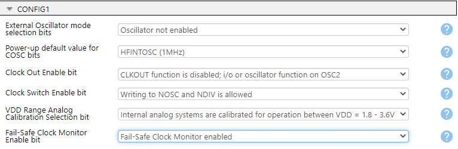
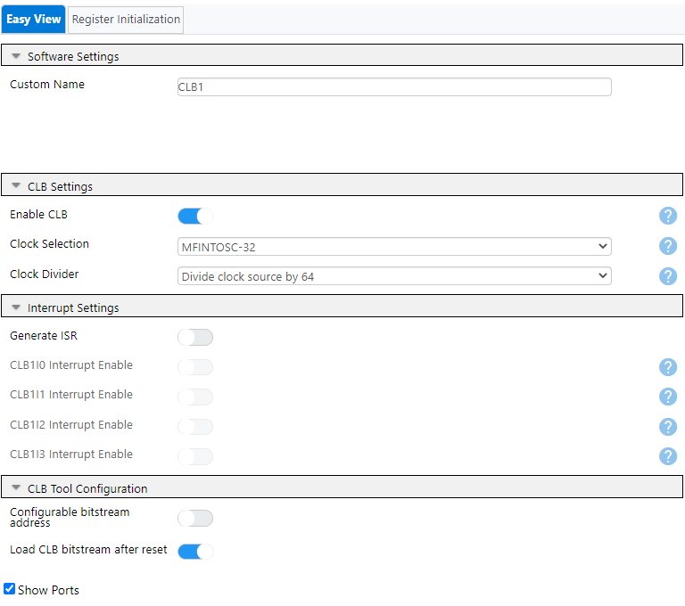
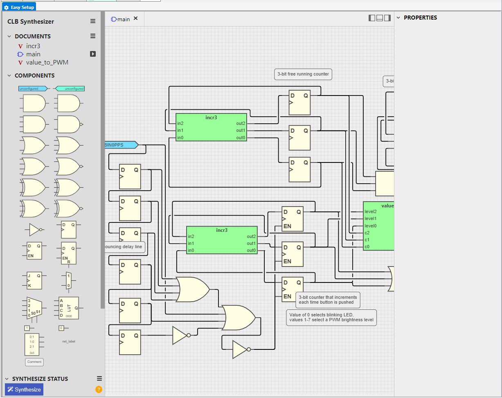
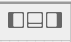
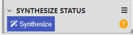
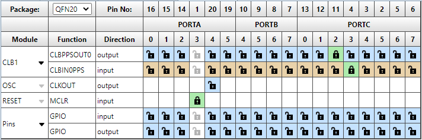
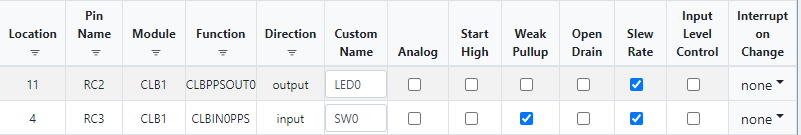
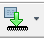
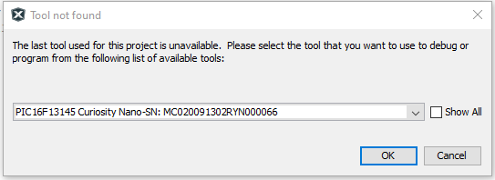

<!-- Please do not change this logo with link -->

# Curiosity Nano Out-of-the-Box Code using PIC16F13145 Microcontroller with MCC Melody
This project comes preloaded on the PIC16F13145 Curiosity Nano board when the user first plugs it in. It consists of a state machine demonstration of the Configurable Logic Block (CLB) peripheral that controls the behavior and/or brightness of the on-board LED. 

## Related Documentation

- [PIC16F13145 Product Page](https://www.microchip.com/en-us/product/PIC16F13145?utm_source=GitHub&utm_medium=TextLink&utm_campaign=MCU8_MMTCha_PIC16F13145&utm_content=pic16f13145-cnano-out-of-box-code-mplab-mcc-github&utm_bu=MCU08)
- [CLB Peripheral Page](https://www.microchip.com/en-us/products/microcontrollers-and-microprocessors/8-bit-mcus/core-independent-and-analog-peripherals/system-flexibility/configurable-logic-block?utm_source=GitHub&utm_medium=TextLink&utm_campaign=MCU8_MMTCha_PIC16F13145&utm_content=pic16f13145-cnano-out-of-box-code-mplab-mcc-github&utm_bu=MCU08)
- [Online, Standalone CLB Configuration Tool](https://logic.microchip.com/clbsynthesizer/)

## Software Used

- [MPLAB® X IDE v6.15.0 or newer](https://www.microchip.com/en-us/tools-resources/develop/mplab-x-ide?utm_source=GitHub&utm_medium=TextLink&utm_campaign=MCU8_MMTCha_PIC16F13145&utm_content=pic16f13145-cnano-out-of-box-code-mplab-mcc-github&utm_bu=MCU08)
- [MPLAB XC8 v2.45.0 or newer compiler](https://www.microchip.com/en-us/tools-resources/develop/mplab-xc-compilers?utm_source=GitHub&utm_medium=TextLink&utm_campaign=MCU8_MMTCha_PIC16F13145&utm_content=pic16f13145-cnano-out-of-box-code-mplab-mcc-github&utm_bu=MCU08)
- [MPLAB Code Configurator](https://www.microchip.com/en-us/tools-resources/configure/mplab-code-configurator?utm_source=GitHub&utm_medium=TextLink&utm_campaign=MCU8_MMTCha_PIC16F13145&utm_content=pic16f13145-cnano-out-of-box-code-mplab-mcc-github&utm_bu=MCU08)
- PIC16F1xxxx_DFP v1.23.382 or newer

## Hardware Used

- [PIC16F13145 Curiosity Nano Evaluation Kit (EV06M52A)](https://www.microchip.com/en-us/development-tool/EV06M52A?utm_source=GitHub&utm_medium=TextLink&utm_campaign=MCU8_MMTCha_PIC16F13145&utm_content=pic16f13145-cnano-out-of-box-code-mplab-mcc-github&utm_bu=MCU08)

## Setup

All necessary hardware is integrated on the Curiosity Nano. No external components are required.

### MCC Setup

* **Configuration Bits**
     * CONFIG1
          * External Oscillator mode selection bits: Oscillator not enabled  
          * Power-up default value for COSC bits: HFINTOSC (1 MHz)  
          * VDD Range Analog Calibration Selection bit: Internal analog systems are calibrated for operation between VDD = 1.8V - 3.6V  

* **CLB Settings**
     * CLB Settings
          * Clock Selection: MFINTOSC-32
          * Clock Divider: Divide clock source by 64  
  
     * Load Configuration
          * CLB Synthesizer &rarr; Load...
               * Select `CnanoCLBdemo.clb` inside of the source code folder  
  
               * Tip: Click on these buttons in the CLB Synthesizer tab toolbar to hide the sidebars for more working space!  
  
               * You can also maximize the current window in MPLAB X IDE by double-clicking on the tab of the desired window to maximize. Double-clicking on this again will return it to normal size.
                    * Window &rarr; Reset Windows can be used to reset all of the window positions and sizes in the IDE, if issues occur.
     * Synthesize the Design
          * Click on the Synthesize button in the bottom left corner to generate the output bitstream.  
  

**Note:** Synthesizing the design is required for the utilized CLB I/O to appear in the pin grid!

* **Pin Grid View**

     - Set CLBPPSOUT0 to RC2
     - Set CLBIN0PPS to RC3

  
* **Pins**

     - Name RC2 to LED0
     - Name RC3 to SW0
     - Enable Weak Pullup for RC3  

  

### Pin Assignments

| Pin Name | Function |
| -------- | -------- |
| RC2 | LED0 Output (Active LOW)
| RC3 | SW0 Pushbutton Input (Active LOW, requires pullup)

## How to Program the Curiosity Nano

1. Connect the Curiosity Nano to the computer with a USB Type-C Cable
2. Open the project folder in MPLAB X IDE
3. Press the Programming Button (arrow into the microcontroller) on the top toolbar  
  
4. Select the Curiosity Nano from the list  
  
5. Wait for the code to compile and programming to complete

## Operation

The CLB peripheral on the PIC16F13145 acts as a button debouncer and state machine for the LED. On power-up, the LED blinks at (nominally) 7.8 Hz. All other states of the state machine change the brightness of the LED via Pulse Width Modulation (PWM) dimming, which is synthesized inside the CLB as well. The pushbutton, SW0, on the Curiosity Nano is debounced within the CLB and used to advance the state machine. The table below shows the behavior for each button press.

| State | LED Behavior |
| ------------ | ------------ |
| 0 | The LED blinks at (nominally) 7.8 Hz.
| 1 | Brightness Level 1 (12.5%)
| 2 | Brightness Level 2 (25%)
| 3 | Brightness Level 3 (37.5%)
| 4 | Brightness Level 4 (50%)
| 5 | Brightness Level 5 (62.5%)
| 6 | Brightness Level 6 (75%)
| 7 | Brightness Level 7 (87.5%)

Note: Percentages are with respect to active LOW.

## Summary
This example has shown how to get started with the CLB on the PIC16F13145 family of microcontrollers.